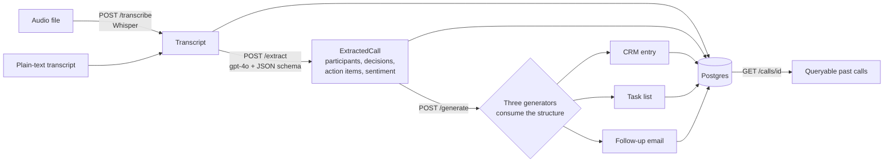

# Voice-to-Structured-Data Agent

[](https://github.com/Khayal07/Voice-to-Structured-Data--Agent/actions/workflows/ci.yml)


Turn call/meeting transcripts (or audio) into structured, actionable output: a
**CRM entry**, a **task list**, and a **follow-up email draft** — generated from a
single extracted structure so the three deliverables stay consistent and cheap.

Sales and support calls generate information that usually stays trapped in a
transcript. This service extracts the structure once (participants, decisions,
action items, sentiment) and derives every deliverable from that structure rather
than re-reading the raw transcript per output.

## Architecture



- **Ingestion** — accept raw audio (Whisper transcription) or plain-text transcripts.
- **Extraction** — one LLM call with structured JSON-schema output produces
  `ExtractedCall`. Every decision/action item carries a `source_quote` to anchor it
  to the transcript and discourage hallucination.
- **Generation** — three focused generators (CRM / tasks / email) each consume the
  `ExtractedCall` structure (never the raw transcript) and run concurrently.
- **Persistence** — every stage is stored in Postgres and linked by foreign key, so
  past calls are queryable.

## Project layout

```
app/
  main.py            FastAPI app, middleware, exception handlers, /health
  config.py          Settings (OpenAI key, models, DB URL, limits)
  errors.py          Domain errors mapped to HTTP status codes
  db/                Async SQLAlchemy engine, session, ORM models
  schemas/           Pydantic: ExtractedCall, CRM/task/email, API envelopes
  services/          openai_client, extraction, transcription, generation/
  prompts/           Prompt templates per layer
  routers/           /transcribe, /extract, /generate, /calls
  static/            Lightweight demo UI (served at /)
migrations/          Alembic migration environment + versions
eval/                Labeled dataset, LLM judge, run_eval.py -> report
tests/               Unit + integration + route tests (LLM mocked, offline)
```

## Setup

Prerequisites: Docker + Docker Compose (and an OpenAI API key for the LLM features).

1. Create your local env file and add a real key:

   ```bash
   cp .env.example .env
   # edit .env and set OPENAI_API_KEY=sk-...
   ```

2. Start the API and Postgres (the container applies DB migrations automatically
   before serving):

   ```bash
   docker compose up --build
   ```

3. Check it's alive:

   ```bash
   curl http://localhost:8000/health
   # {"status":"ok","openai_configured":true,"extraction_model":"gpt-4o",
   #  "generation_model":"gpt-4o-mini","database_connected":true}
   ```

Then open **`http://localhost:8000/`** for a lightweight demo UI (paste a transcript,
get the CRM entry, tasks, and email). Interactive API docs are at
`http://localhost:8000/docs`.

### Environment variables (`.env`)

| Variable | Purpose | Default |
| --- | --- | --- |
| `OPENAI_API_KEY` | Whisper + LLM calls | _(required)_ |
| `OPENAI_EXTRACTION_MODEL` | Extraction + eval judge (accuracy-critical) | `gpt-4o` |
| `OPENAI_GENERATION_MODEL` | CRM/task/email generators (cheaper) | `gpt-4o-mini` |
| `OPENAI_TRANSCRIBE_MODEL` | Transcription model | `whisper-1` |
| `OPENAI_TIMEOUT_SECONDS` | Per-request timeout | `60` |
| `OPENAI_MAX_RETRIES` | Automatic retries on transient errors | `2` |
| `DATABASE_URL` | Async Postgres URL | `postgresql+asyncpg://postgres:postgres@db:5432/voice_agent` |
| `LOG_LEVEL` | Log level | `INFO` |
| `CORS_ALLOW_ORIGINS` | Comma-separated allowed origins | `*` |
| `MAX_TRANSCRIPT_CHARS` | Max transcript size for `/extract` | `100000` |
| `MAX_AUDIO_BYTES` | Max audio upload size for `/transcribe` | `26214400` |

`.env` is git-ignored; `.env.example` (committed) holds placeholders only. Extraction
and generation use **separate models** so accuracy-critical extraction runs on the
stronger model while the generators run on a cheaper one (~16× cheaper per call).

## API

| Method | Path | Description |
| --- | --- | --- |
| `POST` | `/transcribe` | Audio upload → transcript text (stored) |
| `POST` | `/extract` | Transcript (or `transcript_id`) → `ExtractedCall` (stored) |
| `POST` | `/generate` | `extraction_id` or inline structure → CRM + tasks + email |
| `GET` | `/calls/{transcript_id}` | Stored transcript + latest extraction + outputs |
| `GET` | `/health` | Liveness + DB/config check |

Typical flow with `curl`:

```bash
# 1. Extract structure from a transcript
curl -s -X POST http://localhost:8000/extract \
  -H "Content-Type: application/json" \
  -d '{"transcript": "Priya: We want to decide by end of quarter. Marcus: I will send a proposal by Wednesday."}'
# -> {"extraction_id": 1, "transcript_id": 1, "extracted_call": { ... }}

# 2. Generate the three deliverables from that extraction
curl -s -X POST http://localhost:8000/generate \
  -H "Content-Type: application/json" \
  -d '{"extraction_id": 1}'

# 3. Retrieve everything stored for that call
curl -s http://localhost:8000/calls/1

# (optional) transcribe audio first
curl -s -X POST http://localhost:8000/transcribe -F "file=@call.mp3"
```

## Integrate it into your project

It's a plain JSON/HTTP API, so you can call it from any language or wire it into an
existing pipeline. Run the service (`docker compose up`) and point your app at the
base URL (default `http://localhost:8000`). The two calls you need are `/extract`
(transcript → structure) and `/generate` (structure → CRM + tasks + email).

**Python** (`pip install requests`):

```python
import requests

BASE = "http://localhost:8000"
transcript = "Priya: We'll decide by end of quarter. Marcus: I'll send a proposal Wednesday."

extraction = requests.post(f"{BASE}/extract", json={"transcript": transcript}).json()
result = requests.post(f"{BASE}/generate",
                       json={"extraction_id": extraction["extraction_id"]}).json()

crm = result["result"]["crm"]
tasks = result["result"]["tasks"]
email = result["result"]["email"]
print(email["subject"], "→", email["to"])
```

**JavaScript** (`fetch`, works in Node 18+ or the browser):

```js
const BASE = "http://localhost:8000";
const post = (path, body) =>
  fetch(`${BASE}${path}`, {
    method: "POST",
    headers: { "Content-Type": "application/json" },
    body: JSON.stringify(body),
  }).then((r) => r.json());

const { extraction_id } = await post("/extract", { transcript });
const { result } = await post("/generate", { extraction_id });
// result.crm, result.tasks, result.email
```

Notes:
- `/generate` also accepts an inline `{"extracted_call": {...}}` instead of an
  `extraction_id` — useful to regenerate deliverables without a stored extraction.
- Extraction and generation are persisted; fetch a full call later with
  `GET /calls/{transcript_id}`.
- Provider/rate-limit/timeout failures come back as `4xx/5xx` with a JSON `detail`.

## Example

**Input transcript:**

```
Priya (Northwind Analytics): We're evaluating platforms to replace our reporting stack.
Marcus (DataForge): What's your timeline and budget?
Priya: Decision by end of quarter, budget around 60k a year, about 40 users.
Marcus: I'll send a tailored proposal by Wednesday, with two customer references.
Priya: Great. I'll loop in our head of data Aisha for the technical deep-dive next week.
```

**Extracted structure (`/extract`):**

```json
{
  "participants": [
    {"name": "Priya", "role": "buyer", "organization": "Northwind Analytics", "is_primary_contact": true},
    {"name": "Marcus", "role": "vendor", "organization": "DataForge", "is_primary_contact": false}
  ],
  "summary": "Northwind is evaluating platforms to replace their reporting stack. Marcus will send a proposal; a technical deep-dive is planned.",
  "key_points": ["~40 users", "~60k/year budget", "Decision by end of quarter"],
  "decisions": [
    {"description": "Decision to be made by end of quarter", "source_quote": "Decision by end of quarter"}
  ],
  "action_items": [
    {"description": "Send a tailored proposal with two customer references", "owner": "Marcus", "due_date_raw": "Wednesday", "due_date_iso": null, "source_quote": "I'll send a tailored proposal by Wednesday"},
    {"description": "Loop in head of data Aisha for the technical deep-dive", "owner": "Priya", "due_date_raw": "next week", "due_date_iso": null, "source_quote": "loop in our head of data Aisha ... next week"}
  ],
  "sentiment": "positive",
  "outcome": "Proposal to follow; deep-dive scheduled",
  "primary_contact_name": "Priya"
}
```

**Generated deliverables (`/generate`):**

```json
{
  "crm": {
    "contact": {"name": "Priya", "organization": "Northwind Analytics", "role": "buyer", "email": null},
    "deal_stage": "qualification",
    "sentiment": "positive",
    "notes": "Evaluating a replacement for their reporting stack. ~40 users, ~60k/year budget, decision by end of quarter.",
    "next_step": "Send the tailored proposal by Wednesday",
    "open_action_count": 2
  },
  "tasks": [
    {"owner": "Marcus", "description": "Send tailored proposal with two customer references", "due_date": null, "priority": "high"},
    {"owner": "Priya", "description": "Loop in Aisha for the technical deep-dive", "due_date": null, "priority": "medium"}
  ],
  "email": {
    "to": "Priya",
    "subject": "Following up on our call — proposal to follow",
    "body": "Hi Priya,\n\nThanks for the time today. To recap, you're evaluating a replacement for your reporting stack (~40 users, targeting a decision by end of quarter). Next steps:\n\n- I'll send a tailored proposal by Wednesday, including two customer references.\n- You'll loop in Aisha for a technical deep-dive next week.\n\nBest,\n[Your name]"
  }
}
```

## Testing

Unit, integration, and route tests mock the LLM boundary, so they run offline and
free:

```bash
pip install -r requirements-dev.txt
ruff check . && ruff format --check .
pytest
```

Covers structured-output schema validation, malformed-output handling, the
extraction service, the full transcript → CRM + tasks + email pipeline, API routes
(success + 404/413/422/502/503 error paths), and the eval scoring math. The same
checks run in CI on every push/PR (`.github/workflows/ci.yml`).

## Evaluation

The eval measures how well extraction captures reality on a small labeled dataset
(`eval/dataset/`, 5 synthetic transcripts with hand-labeled action items and
decisions). An **LLM judge** semantically matches predicted items to ground truth.
Because the decision vs action-item boundary is fuzzy, the headline metric pools both
categories:

- **Recall** — share of ground-truth items that were captured.
- **Precision** — share of predicted items that match a real item; `1 - precision`
  approximates the hallucination rate.

Latest run (`gpt-4o` extraction; see [`eval/report.md`](eval/report.md) for the full
report with per-transcript breakdown and before/after examples):

| Metric | Precision | Recall |
| --- | --- | --- |
| **Items (pooled)** | **100%** | **76%** |

Precision is 100% (no hallucinated items); the remaining recall gap is mostly soft,
debatable "decisions" the conservative extractor omits rather than invents.

Run it yourself (needs a real `OPENAI_API_KEY`; makes API calls):

```bash
python -m eval.run_eval
```

## Deployment notes

- **Migrations** — schema is managed by Alembic; the container entrypoint runs
  `alembic upgrade head` before starting the API. Create new migrations with
  `alembic revision -m "..."`.
- **Container** — runs as a non-root user with a Docker `HEALTHCHECK`; compose sets a
  restart policy and waits for Postgres to be healthy before starting.
- **Reliability** — OpenAI calls use a configurable timeout and automatic retries;
  provider/auth/rate-limit failures map to clean `4xx/5xx` responses.
- **Hardening for production** — set `CORS_ALLOW_ORIGINS` to your real origins,
  put the service behind TLS, and use managed Postgres with a strong `DATABASE_URL`.

## Tech stack

Python 3.12 · FastAPI · Pydantic · async SQLAlchemy + PostgreSQL · Alembic · OpenAI
(Whisper + gpt-4o structured outputs) · Docker Compose · pytest · ruff · GitHub
Actions CI.

## License

Released under the [MIT License](LICENSE).
